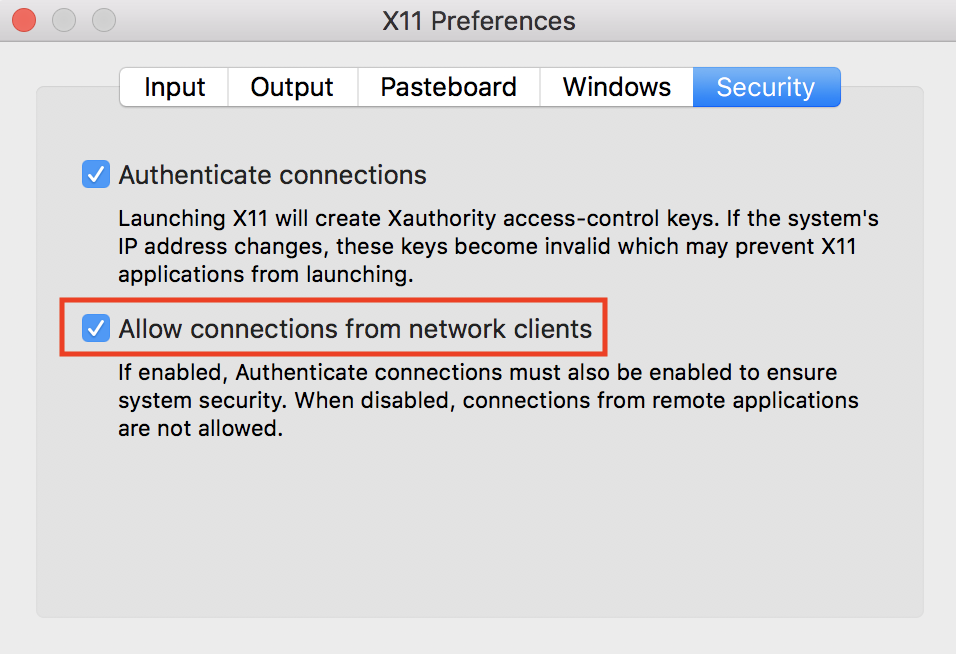

# GoCV

[](http://gocv.io/)

[](https://godoc.org/github.com/hybridgroup/gocv)
[](https://travis-ci.org/hybridgroup/gocv)
[](https://ci.appveyor.com/project/deadprogram/gocv/branch/dev)
[](https://codecov.io/gh/hybridgroup/gocv)
[](https://goreportcard.com/report/github.com/hybridgroup/gocv)
[](https://github.com/hybridgroup/gocv/blob/master/LICENSE.txt)

The GoCV package provides Go language bindings for the [OpenCV 4](http://opencv.org/) computer vision library.

The GoCV package supports the latest releases of Go and OpenCV (v4.1.0) on Linux, macOS, and Windows. We intend to make the Go language a "first-class" client compatible with the latest developments in the OpenCV ecosystem.

GoCV also supports [Intel OpenVINO](https://software.intel.com/en-us/openvino-toolkit). Check out the [OpenVINO README](./openvino/README.md) for more info on how to use GoCV with the Intel OpenVINO toolkit.

## How to use

### Hello, video

This example opens a video capture device using device "0", reads frames, and shows the video in a GUI window:

```go
package main

import (
	"gocv.io/x/gocv"
)

func main() {
	webcam, _ := gocv.OpenVideoCapture(0)
	window := gocv.NewWindow("Hello")
	img := gocv.NewMat()

	for {
		webcam.Read(&img)
		window.IMShow(img)
		window.WaitKey(1)
	}
}
```

### Face detect


This is a more complete example that opens a video capture device using device "0". It also uses the CascadeClassifier class to load an external data file containing the classifier data. The program grabs each frame from the video, then uses the classifier to detect faces. If any faces are found, it draws a green rectangle around each one, then displays the video in an output window:

```go
package main

import (
	"fmt"
	"image/color"

	"gocv.io/x/gocv"
)

func main() {
    // set to use a video capture device 0
    deviceID := 0

	// open webcam
	webcam, err := gocv.OpenVideoCapture(deviceID)
	if err != nil {
		fmt.Println(err)
		return
	}
	defer webcam.Close()

	// open display window
	window := gocv.NewWindow("Face Detect")
	defer window.Close()

	// prepare image matrix
	img := gocv.NewMat()
	defer img.Close()

	// color for the rect when faces detected
	blue := color.RGBA{0, 0, 255, 0}

	// load classifier to recognize faces
	classifier := gocv.NewCascadeClassifier()
	defer classifier.Close()

	if !classifier.Load("data/haarcascade_frontalface_default.xml") {
		fmt.Println("Error reading cascade file: data/haarcascade_frontalface_default.xml")
		return
	}

	fmt.Printf("start reading camera device: %v\n", deviceID)
	for {
		if ok := webcam.Read(&img); !ok {
			fmt.Printf("cannot read device %v\n", deviceID)
			return
		}
		if img.Empty() {
			continue
		}

		// detect faces
		rects := classifier.DetectMultiScale(img)
		fmt.Printf("found %d faces\n", len(rects))

		// draw a rectangle around each face on the original image
		for _, r := range rects {
			gocv.Rectangle(&img, r, blue, 3)
		}

		// show the image in the window, and wait 1 millisecond
		window.IMShow(img)
		window.WaitKey(1)
	}
}
```

### More examples

There are examples in the [cmd directory](./cmd) of this repo in the form of various useful command line utilities, such as [capturing an image file](./cmd/saveimage), [streaming mjpeg video](./cmd/mjpeg-streamer), [counting objects that cross a line](./cmd/counter), and [using OpenCV with Tensorflow for object classification](./cmd/tf-classifier).

## How to install

To install GoCV, run the following command:

```
go get -u -d gocv.io/x/gocv
```

To run code that uses the GoCV package, you must also install OpenCV 4.0.0 on your system. Here are instructions for Ubuntu, Raspian, macOS, and Windows.

## Ubuntu/Linux

### Installation

You can use `make` to install OpenCV 4.1.0 with the handy `Makefile` included with this repo. If you already have installed OpenCV, you do not need to do so again. The installation performed by the `Makefile` is minimal, so it may remove OpenCV options such as Python or Java wrappers if you have already installed OpenCV some other way.

#### Quick Install

The following commands should do everything to download and install OpenCV 4.1.0 on Linux:

	cd $GOPATH/src/gocv.io/x/gocv
	make install

If it works correctly, at the end of the entire process, the following message should be displayed:

	gocv version: 0.20.0
	opencv lib version: 4.1.0

That's it, now you are ready to use GoCV.

#### Complete Install

If you have already done the "Quick Install" as described above, you do not need to run any further commands. For the curious, or for custom installations, here are the details for each of the steps that are performed when you run `make install`.

##### Install required packages

First, you need to change the current directory to the location of the GoCV repo, so you can access the `Makefile`:

	cd $GOPATH/src/gocv.io/x/gocv

Next, you need to update the system, and install any required packages:

	make deps

#### Download source

Now, download the OpenCV 4.1.0 and OpenCV Contrib source code:

	make download

#### Build

Build everything. This will take quite a while:

	make build

#### Install

Once the code is built, you are ready to install:

	make sudo_install

### Verifying the installation

To verify your installation you can run one of the included examples.

First, change the current directory to the location of the GoCV repo:

	cd $GOPATH/src/gocv.io/x/gocv

Now you should be able to build or run any of the examples:

	go run ./cmd/version/main.go

The version program should output the following:

	gocv version: 0.20.0
	opencv lib version: 4.1.0

#### Cleanup extra files

After the installation is complete, you can remove the extra files and folders:

	make clean

### Cache builds

If you are running a version of Go older than v1.10 and not modifying GoCV source, precompile the GoCV package to significantly decrease your build times:

	go install gocv.io/x/gocv

### Custom Environment

By default, pkg-config is used to determine the correct flags for compiling and linking OpenCV. This behavior can be disabled by supplying `-tags customenv` when building/running your application. When building with this tag you will need to supply the CGO environment variables yourself.

For example:

	export CGO_CPPFLAGS="-I/usr/local/include"
	export CGO_LDFLAGS="-L/usr/local/lib -lopencv_core -lopencv_face -lopencv_videoio -lopencv_imgproc -lopencv_highgui -lopencv_imgcodecs -lopencv_objdetect -lopencv_features2d -lopencv_video -lopencv_dnn -lopencv_xfeatures2d"

Please note that you will need to run these 2 lines of code one time in your current session in order to build or run the code, in order to setup the needed ENV variables. Once you have done so, you can execute code that uses GoCV with your custom environment like this:

	go run -tags customenv ./cmd/version/main.go

### Docker

The project now provides `Dockerfile` which lets you build [GoCV](https://gocv.io/) Docker image which you can then use to build and run `GoCV` applications in Docker containers. The `Makefile` contains `docker` target which lets you build Docker image with a single command:

```
make docker
```

By default Docker image built by running the command above ships [Go](https://golang.org/) version `1.11.2`, but if you would like to build an image which uses different version of `Go` you can override the default value when running the target command:

```
make docker GOVERSION='1.11.1'
```

#### Running GUI programs in Docker on macOS

Sometimes your `GoCV` programs create graphical interfaces like windows eg. when you use `gocv.Window` type when you display an image or video stream. Running the programs which create graphical interfaces in Docker container on macOS is unfortunately a bit elaborate, but not impossible. First you need to satisfy the following prerequisites:
* install [xquartz](https://www.xquartz.org/). You can also install xquartz using [homebrew](https://brew.sh/) by running `brew cask install xquartz`
* install [socat](https://linux.die.net/man/1/socat) `brew install socat`

Note, you will have to log out and log back in to your machine once you have installed `xquartz`. This is so the X window system is reloaded.

Once you have installed all the prerequisites you need to allow connections from network clients to `xquartz`. Here is how you do that. First run the following command to open `xquart` so you can configure it:

```shell
open -a xquartz
```
Click on *Security* tab in preferences and check the "Allow connections" box:



Next, you need to create a TCP proxy using `socat` which will stream [X Window](https://en.wikipedia.org/wiki/X_Window_System) data into `xquart`. Before you start the proxy you need to make sure that there is no process listening in port `6000`. The following command should **not** return any results:

```shell
lsof -i TCP:6000
```
Now you can start a local proxy which will proxy the X Window traffic into xquartz which acts a your local X server:

```shell
socat TCP-LISTEN:6000,reuseaddr,fork UNIX-CLIENT:\"$DISPLAY\"
```

You are now finally ready to run your `GoCV` GUI programs in Docker containers. In order to make everything work you must set `DISPLAY` environment variables as shown in a sample command below:

```shell
docker run -it --rm -e DISPLAY=docker.for.mac.host.internal:0 your-gocv-app
```

**Note, since Docker for MacOS does not provide any video device support, you won't be able run GoCV apps which require camera.**

### Alpine 3.7 Docker image

There is a Docker image with Alpine 3.7 that has been created by project contributor [@denismakogon](https://github.com/denismakogon). You can find it located at [https://github.com/denismakogon/gocv-alpine](https://github.com/denismakogon/gocv-alpine).

## Raspbian

### Installation

We have a special installation for the Raspberry Pi that includes some hardware optimizations. You use `make` to install OpenCV 4.1.0 with the handy `Makefile` included with this repo. If you already have installed OpenCV, you do not need to do so again. The installation performed by the `Makefile` is minimal, so it may remove OpenCV options such as Python or Java wrappers if you have already installed OpenCV some other way.

#### Quick Install

The following commands should do everything to download and install OpenCV 4.1.0 on Raspbian:

	cd $GOPATH/src/gocv.io/x/gocv
	make install_raspi

If it works correctly, at the end of the entire process, the following message should be displayed:

	gocv version: 0.20.0
	opencv lib version: 4.1.0

That's it, now you are ready to use GoCV.

## macOS

### Installation

You can install OpenCV 4.1.0 using Homebrew.

If you already have an earlier version of OpenCV (3.4.x) installed, you should probably remove it before installing the new version:

	brew uninstall opencv

You can then install OpenCV 4.1.0:

	brew install opencv

If you prefer, there is also an alternative Homebrew recipe will install only OpenCV 4.1.0 without all of the Python dependencies:

	brew install hybridgroup/tools/opencv

NOTE: Do not install both of these. Choose one.

### pkgconfig Installation
pkg-config is used to determine the correct flags for compiling and linking OpenCV.
You can install it by using Homebrew:

    brew install pkgconfig

### Verifying the installation

To verify your installation you can run one of the included examples.

First, change the current directory to the location of the GoCV repo:

	cd $GOPATH/src/gocv.io/x/gocv

Now you should be able to build or run any of the examples:

	go run ./cmd/version/main.go

The version program should output the following:

	gocv version: 0.20.0
	opencv lib version: 4.1.0

### Cache builds

If you are running a version of Go older than v1.10 and not modifying GoCV source, precompile the GoCV package to significantly decrease your build times:

	go install gocv.io/x/gocv

### Custom Environment

By default, pkg-config is used to determine the correct flags for compiling and linking OpenCV. This behavior can be disabled by supplying `-tags customenv` when building/running your application. When building with this tag you will need to supply the CGO environment variables yourself.

For example:

	export CGO_CXXFLAGS="--std=c++11"
	export CGO_CPPFLAGS="-I/usr/local/Cellar/opencv/4.1.0/include"
	export CGO_LDFLAGS="-L/usr/local/Cellar/opencv/4.1.0/lib -lopencv_stitching -lopencv_superres -lopencv_videostab -lopencv_aruco -lopencv_bgsegm -lopencv_bioinspired -lopencv_ccalib -lopencv_dnn_objdetect -lopencv_dpm -lopencv_face -lopencv_photo -lopencv_fuzzy -lopencv_hfs -lopencv_img_hash -lopencv_line_descriptor -lopencv_optflow -lopencv_reg -lopencv_rgbd -lopencv_saliency -lopencv_stereo -lopencv_structured_light -lopencv_phase_unwrapping -lopencv_surface_matching -lopencv_tracking -lopencv_datasets -lopencv_dnn -lopencv_plot -lopencv_xfeatures2d -lopencv_shape -lopencv_video -lopencv_ml -lopencv_ximgproc -lopencv_calib3d -lopencv_features2d -lopencv_highgui -lopencv_videoio -lopencv_flann -lopencv_xobjdetect -lopencv_imgcodecs -lopencv_objdetect -lopencv_xphoto -lopencv_imgproc -lopencv_core"

Please note that you will need to run these 3 lines of code one time in your current session in order to build or run the code, in order to setup the needed ENV variables. Once you have done so, you can execute code that uses GoCV with your custom environment like this:

	go run -tags customenv ./cmd/version/main.go

## Windows

### Installation

The following assumes that you are running a 64-bit version of Windows 10.

In order to build and install OpenCV 4.1.0 on Windows, you must first download and install MinGW-W64 and CMake, as follows.

#### MinGW-W64

Download and run the MinGW-W64 compiler installer from [https://sourceforge.net/projects/mingw-w64/?source=typ_redirect](https://sourceforge.net/projects/mingw-w64/?source=typ_redirect).

The latest version of the MinGW-W64 toolchain is `7.3.0`, but any version from `7.X` on should work.

Choose the options for "posix" threads, and for "seh" exceptions handling, then install to the default location `c:\Program Files\mingw-w64\x86_64-7.3.0-posix-seh-rt_v5-rev2`.

Add the `C:\Program Files\mingw-w64\x86_64-7.3.0-posix-seh-rt_v5-rev2\mingw64\bin` path to your System Path.

#### CMake

Download and install CMake [https://cmake.org/download/](https://cmake.org/download/) to the default location. CMake installer will add CMake to your system path.

#### OpenCV 4.1.0 and OpenCV Contrib Modules

The following commands should do everything to download and install OpenCV 4.1.0 on Windows:

	chdir %GOPATH%\src\gocv.io\x\gocv
	win_build_opencv.cmd

It might take up to one hour.

Last, add `C:\opencv\build\install\x64\mingw\bin` to your System Path.

### Verifying the installation

Change the current directory to the location of the GoCV repo:

	chdir %GOPATH%\src\gocv.io\x\gocv

Now you should be able to build or run any of the command examples:

	go run cmd\version\main.go

The version program should output the following:

	gocv version: 0.20.0
	opencv lib version: 4.1.0

That's it, now you are ready to use GoCV.

### Cache builds

If you are running a version of Go older than v1.10 and not modifying GoCV source, precompile the GoCV package to significantly decrease your build times:

	go install gocv.io/x/gocv

### Custom Environment

By default, OpenCV is expected to be in `C:\opencv\build\install\include`. This behavior can be disabled by supplying `-tags customenv` when building/running your application. When building with this tag you will need to supply the CGO environment variables yourself.

Due to the way OpenCV produces DLLs, including the version in the name, using this method is required if you're using a different version of OpenCV.

For example:

	set CGO_CXXFLAGS="--std=c++11"
	set CGO_CPPFLAGS=-IC:\opencv\build\install\include
	set CGO_LDFLAGS=-LC:\opencv\build\install\x64\mingw\lib -lopencv_core401 -lopencv_face401 -lopencv_videoio401 -lopencv_imgproc401 -lopencv_highgui401 -lopencv_imgcodecs401 -lopencv_objdetect401 -lopencv_features2d401 -lopencv_video401 -lopencv_dnn401 -lopencv_xfeatures2d401 -lopencv_plot401 -lopencv_tracking401 -lopencv_img_hash401

Please note that you will need to run these 3 lines of code one time in your current session in order to build or run the code, in order to setup the needed ENV variables. Once you have done so, you can execute code that uses GoCV with your custom environment like this:

	go run -tags customenv cmd\version\main.go

## Android

There is some work in progress for running GoCV on Android using Gomobile. For information on how to install OpenCV/GoCV for Android, please see:
https://gist.github.com/ogero/c19458cf64bd3e91faae85c3ac887481

See original discussion here:
https://github.com/hybridgroup/gocv/issues/235

## Profiling

Since memory allocations for images in GoCV are done through C based code, the go garbage collector will not clean all resources associated with a `Mat`.  As a result, any `Mat` created *must* be closed to avoid memory leaks.

To ease the detection and repair of the resource leaks, GoCV provides a `Mat` profiler that records when each `Mat` is created and closed.  Each time a `Mat` is allocated, the stack trace is added to the profile.  When it is closed, the stack trace is removed. See the [runtime/pprof documentation](https://golang.org/pkg/runtime/pprof/#Profile).

In order to include the MatProfile custom profiler, you MUST build or run your application or tests using the `-tags matprofile` build tag. For example:

	go run -tags matprofile cmd/version/main.go

You can get the profile's count at any time using:

```go
gocv.MatProfile.Count()
```

You can display the current entries (the stack traces) with:

```go
var b bytes.Buffer
gocv.MatProfile.WriteTo(&b, 1)
fmt.Print(b.String())
```

This can be very helpful to track down a leak.  For example, suppose you have
the following nonsense program:

```go
package main

import (
	"bytes"
	"fmt"

	"gocv.io/x/gocv"
)

func leak() {
	gocv.NewMat()
}

func main() {
	fmt.Printf("initial MatProfile count: %v\n", gocv.MatProfile.Count())
	leak()

	fmt.Printf("final MatProfile count: %v\n", gocv.MatProfile.Count())
	var b bytes.Buffer
	gocv.MatProfile.WriteTo(&b, 1)
	fmt.Print(b.String())
}
```

Running this program produces the following output:

```
initial MatProfile count: 0
final MatProfile count: 1
gocv.io/x/gocv.Mat profile: total 1
1 @ 0x40b936c 0x40b93b7 0x40b94e2 0x40b95af 0x402cd87 0x40558e1
#	0x40b936b	gocv.io/x/gocv.newMat+0x4b	/go/src/gocv.io/x/gocv/core.go:153
#	0x40b93b6	gocv.io/x/gocv.NewMat+0x26	/go/src/gocv.io/x/gocv/core.go:159
#	0x40b94e1	main.leak+0x21			/go/src/github.com/dougnd/gocvprofexample/main.go:11
#	0x40b95ae	main.main+0xae			/go/src/github.com/dougnd/gocvprofexample/main.go:16
#	0x402cd86	runtime.main+0x206		/usr/local/Cellar/go/1.11.1/libexec/src/runtime/proc.go:201
```

We can see that this program would leak memory.  As it exited, it had one `Mat` that was never closed.  The stack trace points to exactly which line the allocation happened on (line 11, the `gocv.NewMat()`).

Furthermore, if the program is a long running process or if GoCV is being used on a web server, it may be helpful to install the HTTP interface )). For example:

```go
package main

import (
	"net/http"
	_ "net/http/pprof"
	"time"

	"gocv.io/x/gocv"
)

func leak() {
	gocv.NewMat()
}

func main() {
	go func() {
		ticker := time.NewTicker(time.Second)
		for {
			<-ticker.C
			leak()
		}
	}()

	http.ListenAndServe("localhost:6060", nil)
}

```

This will leak a `Mat` once per second.  You can see the current profile count and stack traces by going to the installed HTTP debug interface: [http://localhost:6060/debug/pprof/gocv.io/x/gocv.Mat](http://localhost:6060/debug/pprof/gocv.io/x/gocv.Mat?debug=1).


## How to contribute

Please take a look at our [CONTRIBUTING.md](./CONTRIBUTING.md) document to understand our contribution guidelines.

Then check out our [ROADMAP.md](./ROADMAP.md) document to know what to work on next.

## Why this project exists

The [https://github.com/go-opencv/go-opencv](https://github.com/go-opencv/go-opencv) package for Go and OpenCV does not support any version above OpenCV 2.x, and work on adding support for OpenCV 3 had stalled for over a year, mostly due to the complexity of [SWIG](http://swig.org/). That is why we started this project.

The GoCV package uses a C-style wrapper around the OpenCV 4 C++ classes to avoid having to deal with applying SWIG to a huge existing codebase. The mappings are intended to match as closely as possible to the original OpenCV project structure, to make it easier to find things, and to be able to figure out where to add support to GoCV for additional OpenCV image filters, algorithms, and other features.

For example, the [OpenCV `videoio` module](https://github.com/opencv/opencv/tree/master/modules/videoio) wrappers can be found in the GoCV package in the `videoio.*` files.

This package was inspired by the original https://github.com/go-opencv/go-opencv project, the blog post https://medium.com/@peterleyssens/using-opencv-3-from-golang-5510c312a3c and the repo at https://github.com/sensorbee/opencv thank you all!

## License

Licensed under the Apache 2.0 license. Copyright (c) 2017-2018 The Hybrid Group.

Logo generated by GopherizeMe - https://gopherize.me
